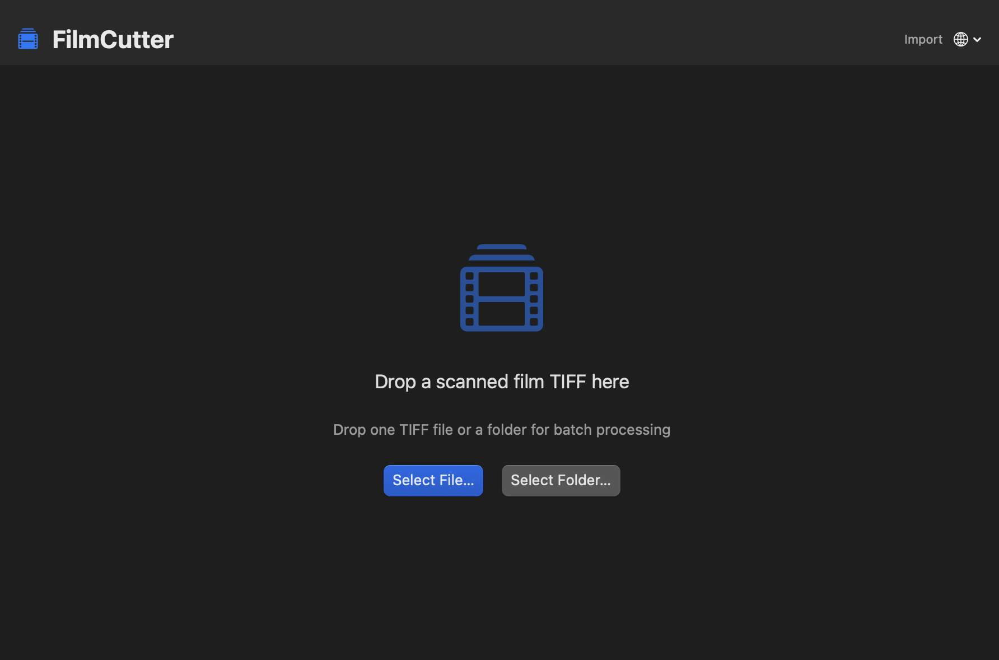

# FilmCutter

> Current release: **1.01 Beta** (`v1.0.1-beta.1`)
> Copyright © 2026 Warsawying

FilmCutter is a native macOS app that detects frames in scanned film TIFFs and
exports them as individual, color-managed 16-bit TIFF files.

FilmCutter 是一个原生 macOS 胶片裁切工具：导入胶片扫描稿，检查或手动调整画格，
然后批量导出独立 TIFF。

<p align="center">
  
</p>

## Download / 下载

**[Download FilmCutter 1.01 Beta for Apple Silicon](https://github.com/WarsawYing/FilmCutter/releases/download/v1.0.1-beta.1/FilmCutter-1.01-Beta-macOS-Apple-Silicon.zip)**

- macOS 14 or later
- Apple Silicon (M1/M2/M3/M4 and later)
- Fully self-contained and offline after download
- No Python, Homebrew or Xcode installation required

After downloading, unzip the package and double-click `安装 FilmCutter.command`.
The app is installed to `~/Applications` and can be opened normally afterwards.

下载后解压，双击 `安装 FilmCutter.command`。安装完成后，应用会出现在
`~/Applications`，以后直接点击 FilmCutter 即可。

Because this Beta is ad-hoc signed, the first launch may require right-clicking
FilmCutter and choosing **Open**, or approving it under **Privacy & Security**.
The installer does not remove quarantine or bypass Gatekeeper.

## What’s new in 1.01 Beta

- Live language switching: English, 简体中文, 日本語, Español and Français.
- Reversible **Import → Preview & Adjust → Export Confirmation** workflow.
- V2 is now the only stable detector; the Classic detector has been removed.
- Film formats: Auto, 135 full frame, 135 half frame, 65×24, 645, 6×6,
  6×7, 6×8, 6×9, 6×12 and 6×17.
- Optional expected frame count as a soft hint—blank frames are never invented.
- Optional experimental boundary refinement with automatic safe fallback.
- Per-scan format, detection, manual edits and undo/redo history.
- Natural input ordering, Unicode naming preview, collision checks and no overwrite.
- Preserves 8/16-bit pixels, ICC profile and scan resolution.
- Self-contained CPython runtime with only NumPy and tifffile; no pip, SciPy,
  Pillow, OpenCV, ML model or background download.

This Beta guarantees uncompressed, single-page 8/16-bit grayscale and RGB TIFF
input. Unsupported compression and multi-page TIFFs are rejected with a clear
error instead of silently changing pixels.

## Release history / 版本历史

| Version | Status | Date | Documentation | Download |
|---|---|---|---|---|
| **1.01 Beta** (`v1.0.1-beta.1`) | Current pre-release | 2026-08-12 | [Release notes](versions/v1.0.1-beta.1/README.md) · [Install](versions/v1.0.1-beta.1/INSTALL.md) | [ZIP](https://github.com/WarsawYing/FilmCutter/releases/download/v1.0.1-beta.1/FilmCutter-1.01-Beta-macOS-Apple-Silicon.zip) |
| Ver.1 (`v1.0.0`) | Archived | 2026 | [Original documentation](versions/v1.0.0/README.md) | Source archive / original distribution |

The repository homepage always describes the newest version. Previous release
documents stay under [`versions/`](versions/) and source snapshots are retained
by Git tags.

## Build and test

The release workspace contains pinned offline build inputs:

- CPython 3.13.15 Apple Silicon runtime
- NumPy 2.5.1
- tifffile 2026.7.14

```sh
./setup.sh
FILMCUTTER_FIXTURE_DIR=/path/to/private-fixtures \
  .release-work/FilmCutter.app/Contents/Resources/PythonRuntime/bin/python3 \
  -B PythonEngine/test_engine.py
swift test --package-path FilmCutterApp --disable-sandbox
scripts/build_release.sh
scripts/verify_release.sh
```

`scripts/build_release.sh` is offline when the pinned `vendor/` files are
present. `scripts/prepare_vendor.sh` is only needed to recreate that cache.
Large real TIFFs are excluded from Git; `test-fixtures/manifest.json` stores
their hashes and the formal v1.1 validation gate.

## License, contributions and branding

Community source code is licensed under AGPL-3.0. See
[`COMMERCIAL-LICENSE.md`](COMMERCIAL-LICENSE.md) for commercial licensing,
[`CLA.md`](CLA.md) for contributions, [`TRADEMARKS.md`](TRADEMARKS.md) for the
FilmCutter name and logo, and [`THIRD_PARTY_NOTICES.md`](THIRD_PARTY_NOTICES.md)
for bundled components.

Legal texts should be reviewed by qualified counsel before accepting external
contributions or entering a commercial agreement.
